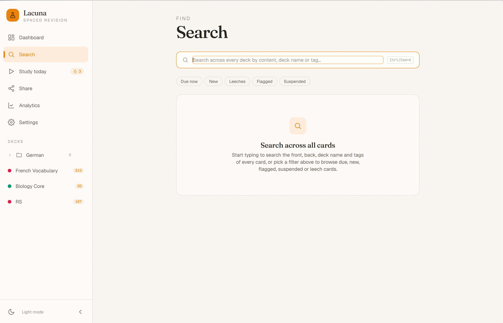

# New Features + Bugs
This file is for keeping track of new features and bugs that we want to add to the project. This is a living document and will be updated as we add new features and fix bugs. All previously fixed bugs and added features will be in 'CHANGES.md'.

## New Features
- [ ] Add a new learn mode that's simply all the flashcards; a new mode that has no algorithms; simply a YES/NO for whether you got the flashcard right or wrong. This is for people who want to just learn the flashcards without any algorithms, and loops until all have been marked yes. There should be a new UI for this, with updated info to the left and right (thinking a pill that's red for things that are still wrong, a grey one for neutral things and a green one for things that are right, and the pill should update as you mark things right or wrong).
- [ ] For study modes such as Due cards, New cards, Leech or Flagged cards that have no cards in it, currently, it simply just flashes and reloads the page. This looks unprofessional. Can a UI be implemented for this, as well as perhaps some analytics for them as well if there are no cards?! [alt text](image.png)
- [ ] There is no obvious way of deleting folders, which is a rather crucial part of the system.

## Bugs
- [ ] The selection for text is very odd, there's an internal ring around the textbox itself, but an external ring surroudning the whole outer pill/thing. Can you try to disable the internal ring? 
- [ ] In touch first mode, can the default text size be set to 'Large', and normal for the keyboard first mode, and the swipe left (from the left hand side to the right) gesture on individual cards be customised? Also, can the 3 item menu for swiping right (from the right hand side to the left) also be customisable in the settings?
- [ ] Share code importing in the New Deck button on the Dashboard and the Share tab is broken. It detects the share code but shows up as 0 cards and breaks for both legacy share codes and the new more efficient version.